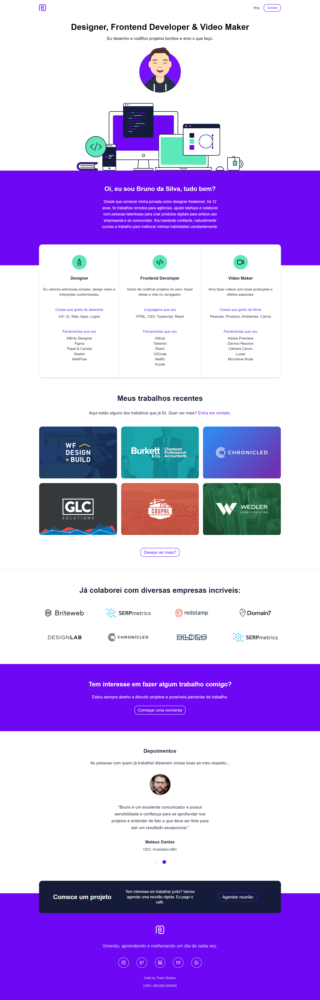

<h2> Meu Portfólio Pessoal 🚀 </h2>

  

Este é o código-fonte do meu portfólio pessoal, desenvolvido durante o curso "10 Projetos em HTML, CSS e Javascript" da B7Web. 

<h3>Tecnologias utilizadas:</h3>

<ul>
  <li>HTML</li>
  <li>CSS</li>
  <li>Javascript</li>
</ul>

<h3>Destaques do projeto:</h3>

<ul>
  <li><b>Layout responsivo e Mobile First:</b> O site se adapta a diferentes tamanhos de tela, priorizando a experiência em dispositivos móveis. </li>
  <li><b>CSS Split:</b> Durante o desenvolvimento, cada seção do site teve seu próprio arquivo CSS para melhor organização e manutenção do código. Posteriormente, todos os arquivos foram unificados em um único arquivo CSS para otimização da performance.</li>
</ul>

<h3> Acesse o projeto: </h3>
<a href="https://taoliveira.com.br/portofolio-pessoal-b7web"> link para o seu portfólio</a> 

<h3>Aprendizados:</h3>

Este projeto me permitiu solidificar meus conhecimentos em:

<ul>
  <li>Desenvolvimento web com HTML, CSS e Javascript;</li>
  <li>Criação de layouts responsivos utilizando a abordagem Mobile First;</li>
  <li>Organização e gerenciamento de código CSS com a técnica CSS Split.</li>
</ul>

<h3>Próximos passos:</h3>

<ul>
  <li>Adicionar mais projetos ao portfólio;</li>
  <li>Implementar animações e transições para uma experiência mais dinâmica;</li>
  <li>Integrar com um CMS para facilitar a atualização do conteúdo.</li>
</ul>

Fique à vontade para explorar o código e me contatar caso tenha alguma dúvida ou sugestão! 😊
